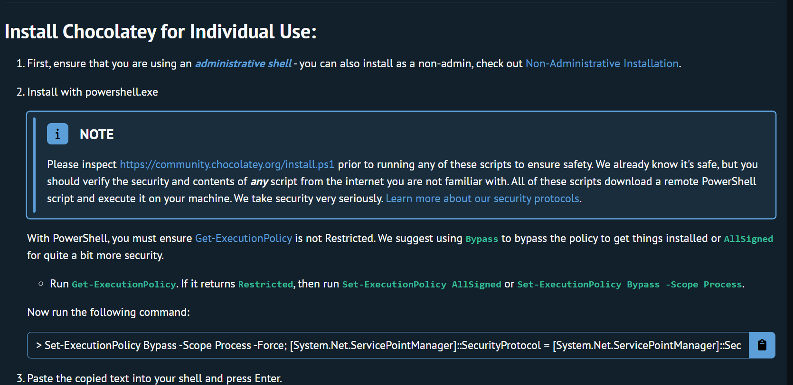
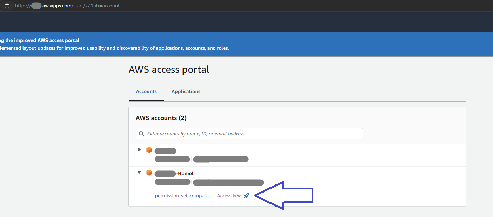
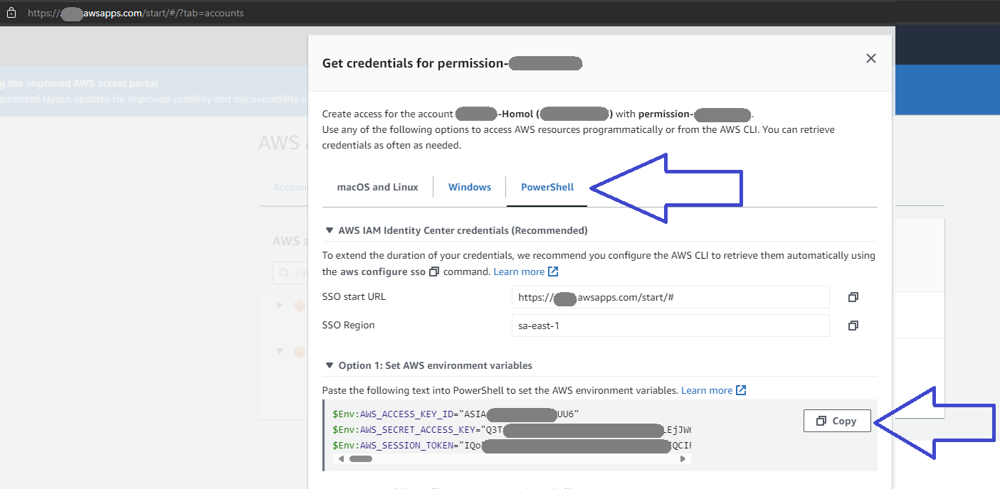
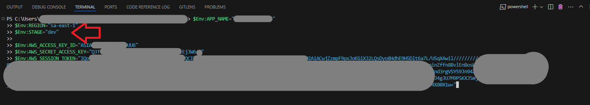
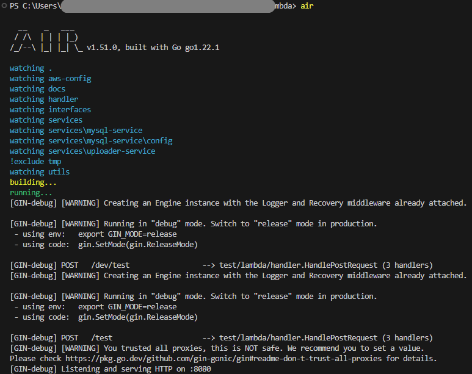

I created this Lambda five months ago (March 2024) before I began studying and working with Spring Boot. It served as a proof of concept for Go's capabilities, and I am posting it here in this repository for future reference.
# How to run

## Table of Contents
1. [Needed Tools](#1-needed-tools)
2. [Installation](#2-installation)
   - [Clone Repository](#21-clone-repository)
   - [Install Go](#22-install-go)
   - [Install Chocolatey, Mingw, and Make](#23-install-chocolatey-mingw-and-make)
   - [Download Dependencies](#24-download-dependencies)
   - [Install Air](#25-install-air)
3. [AWS Environment Variables Setup](#3-aws-environment-variables-setup)
4. [Running Locally](#4-running-locally)
5. [Deployment](#5-deployment)
   - [Important Note](#51-important-note)
   - [Deploy](#52-deploy)
   - [Remove Deployment](#53-remove-deployment)
   - [Update Lambda](#54-update-lambda)
6. [Generate Binary and .serverless (Without Deploying)](#6-generate-binary-and-serverless-without-deploying)

## 1. Needed Tools

- Go 
- Chocolatey  
- Mingw
- Make
- AWS Secret Manager

## 2. Installation

### 2.1 Clone Repository

   ```bash
   git clone <url_to_define>
   ```

### 2.2 Install Go

   - [Go Installation Guide](https://go.dev/doc/install)

### 2.3 Install Chocolatey, Mingw, and Make

   1. [Install Chocolatey](https://chocolatey.org/install#install-step2)

      

   2. With Chocolatey installed, install Mingw and Make:

      ```bash
      choco install mingw
      ```

      ```bash
      choco install make
      ```

### 2.4 Download Dependencies

   ```bash
   go mod download
   ```

### 2.5 Install Air

   ```bash
   go install github.com/cosmtrek/air@latest
   ```

## 3. AWS Environment Variables Setup

   This Lambda requires AWS environment variables.

   

   

   Copy AWS credentials and set them in your environment:

   ```shell
   $Env:APP_NAME="GO_LAMBDA"
   $Env:REGION="sa-east-1"  # Your region
   $Env:STAGE="dev" 
   ```

   Paste the credentials into PowerShell:

   

   Your environment variables should look like this:

   ```shell
   $Env:APP_NAME="GO_LAMBDA"
   $Env:REGION="sa-east-1" 
   $Env:STAGE="dev" 

   $Env:AWS_ACCESS_KEY_ID="ASIA/AKIA...."
   $Env:AWS_SECRET_ACCESS_KEY="........."
   $Env:AWS_SESSION_TOKEN="............."
   ```

## 4. Running Locally

Use Air to run the application with the environment variables set. This means we're testing the application on our local
machine without needing to deploy it to AWS. The application will run on the predefined port specified in the .env file:
   ```shell
   air
   ```

   

## 5. Deployment

### 5.1 Important Note

   Before deploying, *ALWAYS* run the following command to delete the temporary folder generated by Air:

   ```bash
   make update_lambda
   ```

### 5.2 Deploy

   This will create the `.serverless` folder with `cloudformation-template-update-stack`, `serverless-state.json`, and `tabloid-go-poc.zip` using the bootstrap file and deploy it to AWS:

   ```bash
   make deploy_dev
   ``` 

### 5.3 Remove Deployment

   Remove files from S3 and the CloudFormation stack:

   ```bash
   make delete_dev
   ``` 

### 5.4 Update Lambda

   This generates the bootstrap binary, replacing it if it exists. It also deletes the `.serverless` and `temp` folders:

   ```bash 
   make update_lambda
   ```

## 6. Generate Binary and .serverless (Without Deploying)

   Install `serverless-offline`:

   ```bash
   npm install -g serverless-offline
   ```

   Create the `.serverless` folder using the 'bootstrap' file to create the zip:

   ```bash 
   make package
   ```
