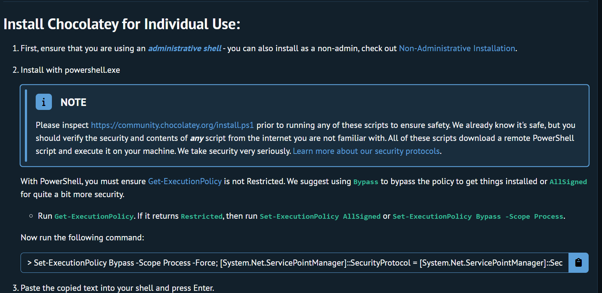
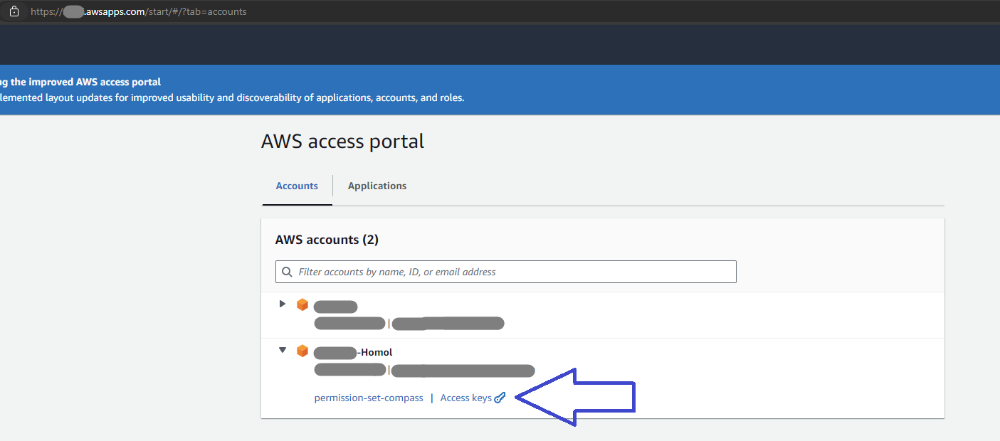
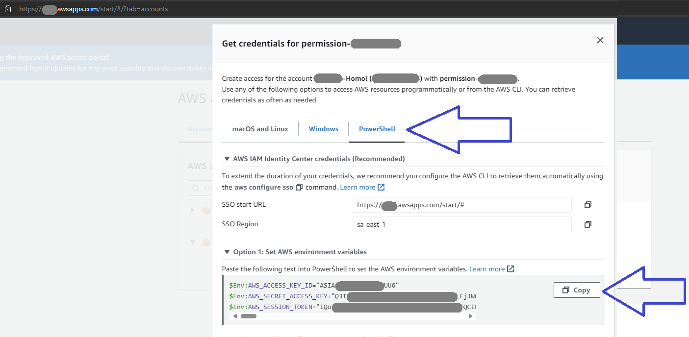
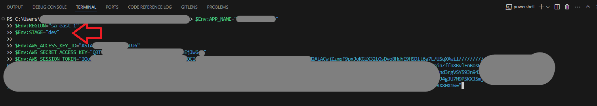
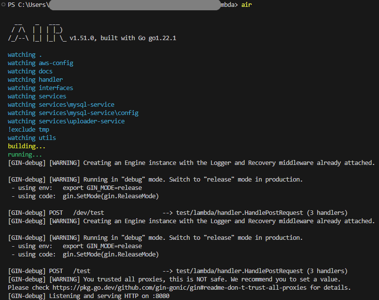

I created this Lambda five months ago (March 2024) before I began studying and working with Spring Boot. It served as a proof of concept for Go's capabilities, and I am posting it here in this repository for future reference.
# How to run

## Table of Contents
1. [Results](#1-results)
2. [Needed Tools](#2-needed-tools)
3. [Installation](#3-installation)
   - [Clone Repository](#31-clone-repository)
   - [Install Go](#32-install-go)
   - [Install Chocolatey, Mingw, and Make](#33-install-chocolatey-mingw-and-make)
   - [Download Dependencies](#34-download-dependencies)
   - [Install Air](#35-install-air)
4. [AWS Environment Variables Setup](#4-aws-environment-variables-setup)
5. [Running Locally](#5-running-locally)
6. [Deployment](#6-deployment)
   - [Important Note](#61-important-note)
   - [Deploy](#62-deploy)
   - [Remove Deployment](#63-remove-deployment)
   - [Update Lambda](#64-update-lambda)
7. [Generate Binary and .serverless (Without Deploying)](#7-generate-binary-and-serverless-without-deploying)

## 1. Results
## Performance Comparison: Go vs. Node.js in AWS Lambda

This comparison highlights the differences between Go and Node.js when deployed as AWS Lambda functions. The results show Go's efficiency in terms of execution time, memory usage, billed duration, and cold-start time compared to Node.js.

#### Key Metrics:
- **Execution Time:** Measures how long the function takes to run.
- **Memory Usage:** Reflects the maximum memory consumed during the execution.
- **Billed Duration:** The duration billed by AWS, rounded up to the nearest 100ms.
- **Init Duration:** Time taken for the function to initialize (cold start).

| **Language** | **Execution Time (ms)** | **Memory Used (MB)** | **Init Duration (ms)** | **Billed Duration (ms)** | **Billed Duration % Difference** |
|--------------|--------------------------|-----------------------|-------------------------|---------------------------|----------------------------------|
| **Go**       | 239 ms                  | 34 MB                | ~0 ms                  | 240 ms                    | 0%                               |
| **Node.js**  | 407 ms                  | 133 MB               | 1390 ms                | 408 ms                    | 70.8%                            |

#### Observations:
1. **Go Lambda:**
   - **Execution Time:** 239 ms (efficient).
   - **Memory Usage:** 34 MB (minimal usage).
   - **Billed Duration:** 240 ms (rounded up from 239.69 ms), no significant difference from execution time.
   - **Init Duration:** Extremely fast, with minimal initialization time.
   
2. **Node.js Lambda:**
   - **Execution Time:** 407 ms (longer compared to Go).
   - **Memory Usage:** 133 MB (higher memory consumption).
   - **Billed Duration:** 408 ms (rounded up from 407.47 ms).
   - **Init Duration:** 1390 ms (significant cold-start overhead).
   - **Billed Duration % Difference:** Node.js has a 70.8% longer billed duration compared to Go, highlighting its less efficient execution.

#### Conclusion:
- **Go** outperforms **Node.js** in both execution time and memory usage, making it the more efficient choice for Lambda functions.
- **Node.js** incurs a higher billed duration, especially due to a significant cold start time (init duration), which results in longer overall performance.
- If low latency and minimal resource usage are a priority, **Go** is the superior option for Lambda-based applications.
  
By choosing **Go** for AWS Lambda, we can achieve lower execution costs, faster response times, and higher efficiency.


## 2. Needed Tools

- Go 
- Chocolatey  
- Mingw
- Make
- AWS Secret Manager

## 3. Installation

### 3.1 Clone Repository

   ```bash
   git clone https://github.com/Marcosxx1/go-lambda.git
   ```

### 3.2 Install Go

   - [Go Installation Guide](https://go.dev/doc/install)

### 3.3 Install Chocolatey, Mingw, and Make

   1. [Install Chocolatey](https://chocolatey.org/install#install-step2)

      

   2. With Chocolatey installed, install Mingw and Make:

      ```bash
      choco install mingw
      ```

      ```bash
      choco install make
      ```

### 3.4 Download Dependencies

   ```bash
   go mod download
   ```

### 3.5 Install Air

   ```bash
   go install github.com/cosmtrek/air@latest
   ```

## 4. AWS Environment Variables Setup

   This Lambda requires AWS environment variables.

   

   

   Copy AWS credentials and set them in your environment:

   ```shell
   $Env:APP_NAME="GO_LAMBDA"
   $Env:REGION="sa-east-1"  # Your region
   $Env:STAGE="dev" 
   ```

   Paste the credentials into PowerShell:

   

   Your environment variables should look like this:

   ```shell
   $Env:APP_NAME="GO_LAMBDA"
   $Env:REGION="sa-east-1" 
   $Env:STAGE="dev" 

   $Env:AWS_ACCESS_KEY_ID="ASIA/AKIA...."
   $Env:AWS_SECRET_ACCESS_KEY="........."
   $Env:AWS_SESSION_TOKEN="............."
   ```

## 5. Running Locally

Use Air to run the application with the environment variables set. This means we're testing the application on our local
machine without needing to deploy it to AWS. The application will run on the predefined port specified in the .env file:
   ```shell
   air
   ```

   

## 6. Deployment

### 6.1 Important Note

   Before deploying, *ALWAYS* run the following command to delete the temporary folder generated by Air:

   ```bash
   make update_lambda
   ```

### 6.2 Deploy

   This will create the `.serverless` folder with `cloudformation-template-update-stack`, `serverless-state.json`, and `tabloid-go-poc.zip` using the bootstrap file and deploy it to AWS:

   ```bash
   make deploy_dev
   ``` 

### 6.3 Remove Deployment

   Remove files from S3 and the CloudFormation stack:

   ```bash
   make delete_dev
   ``` 

### 6.4 Update Lambda

   This generates the bootstrap binary, replacing it if it exists. It also deletes the `.serverless` and `temp` folders:

   ```bash 
   make update_lambda
   ```

## 7. Generate Binary and .serverless (Without Deploying)

   Install `serverless-offline`:

   ```bash
   npm install -g serverless-offline
   ```

   Create the `.serverless` folder using the 'bootstrap' file to create the zip:

   ```bash 
   make package
   ```
